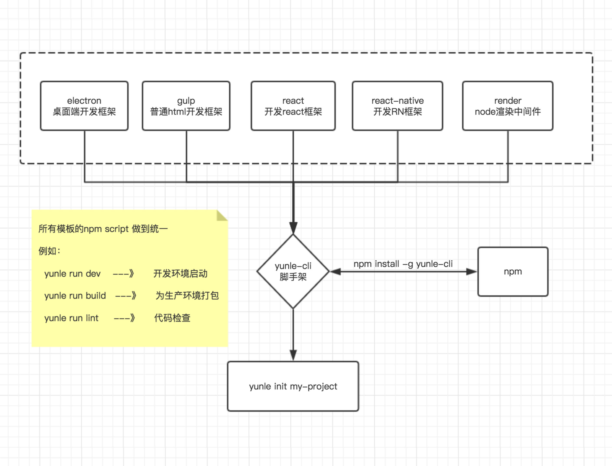
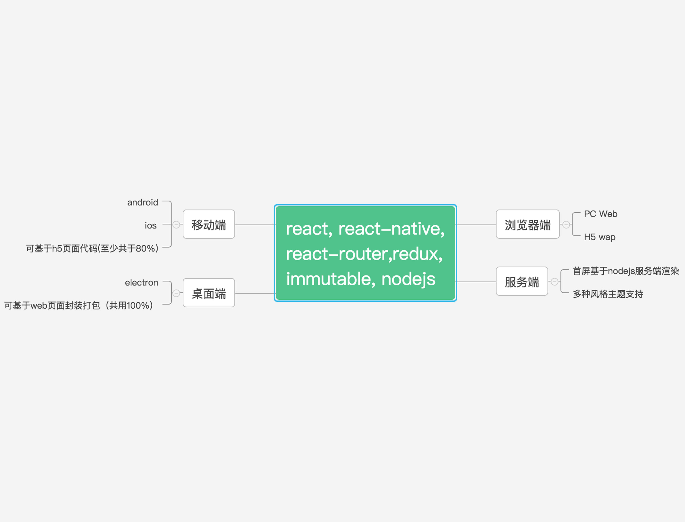

# A simple CLI for scaffolding yunle projects [](https://travis-ci.org/hexiao-o/yunle-cli)

## Installation

Prerequisites: Node.js (>=5.x, 6.x preferred) and Git.

```
$ npm install -g yunle-cli
```

## Usage

```
$ yunle init <project-name>

```

### Example:

```
$ yunle init my-project

$ > gulp
    webpack
    react
    node
```



